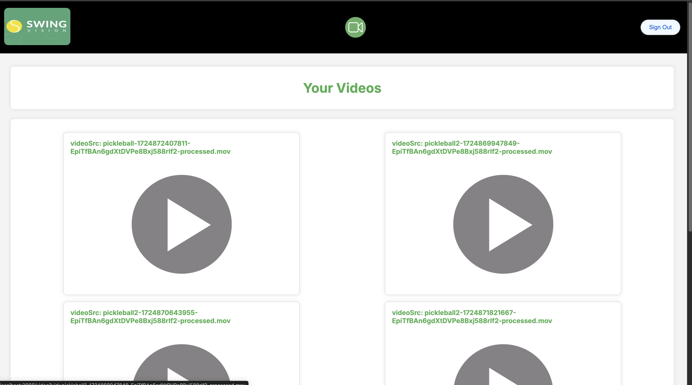

# SwingVision Transcoder

## Project Overview
SwingVision Transcoder is a demonstration project that automatically converts uploaded videos to a lower resolution format (360p), simulating compatibility with a freemium version of SwingVision. While the actual freemium version uses 720p, this project uses 360p for demonstration purposes.

This project showcases:
- Technical proficiency in cloud-based video processing
- Ability to learn and integrate new technologies
- Development of a practical, user-beneficial application

## Core Functionalities
- Google Authentication (Sign In/Sign Out)
- Video Upload
- Viewing and Management of Transcoded Videos

## System Architecture

## Technical Overview

### Video Storage
- Utilizes Google Cloud Storage
- Scalable and cost-effective solution for raw and processed video storage

### Message Queue System
- Implements Google Pub/Sub
- Enables parallel processing of video transcoding tasks
- Triggers processing upon video upload

### Video Processing Worker
- Express app with a single POST endpoint: "/process-video"
- Process:
  1. Checks for existing video processing status
  2. Updates video document in Google Firestore
  3. Downloads video from Cloud Storage
  4. Converts video to 360p using FFMPEG
  5. Uploads processed video to Cloud Storage
  6. Cleans up local files

### Metadata Management
- Uses Google Firestore (NoSQL)
- Stores user information and video metadata
- Tracks video processing status for idempotency

### Video API
- Serverless function-based API
- Handles:
  - User creation and information storage
  - Generation of time-limited signed URLs for direct video uploads
  - Retrieval of user-specific video metadata

### Authentication
- Implements Firebase Authentication with Google Sign-In

### Web Client
- Built with Next.js
- Dockerized and hosted on Google Cloud Artifacts Repository

## References
official documentation:

- [Firebase Authentication](https://firebase.google.com/docs/auth)
- [Cloud Storage Signed URLs](https://cloud.google.com/storage/docs/access-control/signed-urls)
- [Cloud Storage with Pub/Sub](https://cloud.google.com/storage/docs/pubsub-notifications)
- [Pub/Sub Push Subscriptions](https://cloud.google.com/pubsub/docs/push)
- [Cloud Run with Pub/Sub](https://cloud.google.com/run/docs/tutorials/pubsub)
